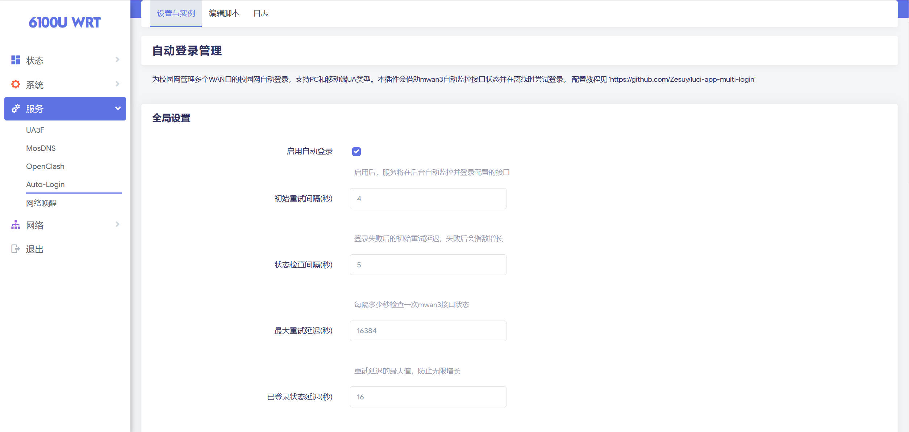
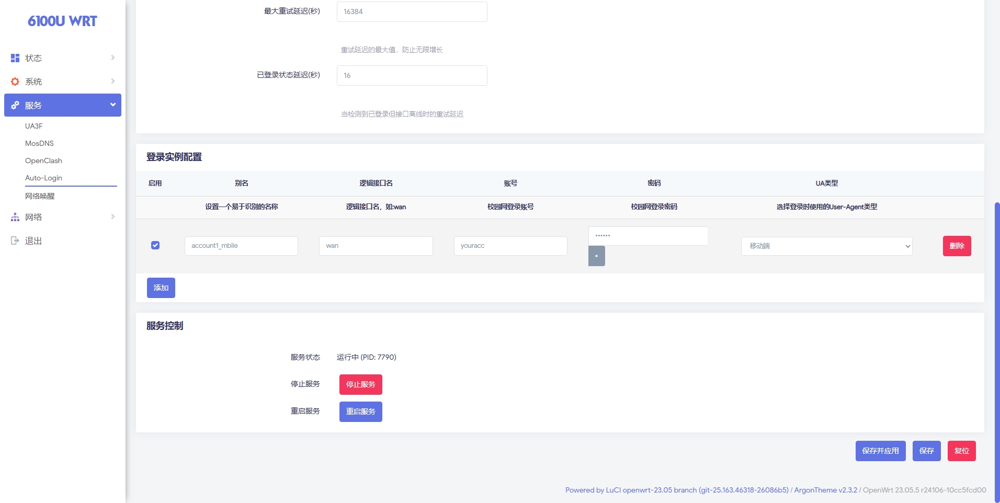
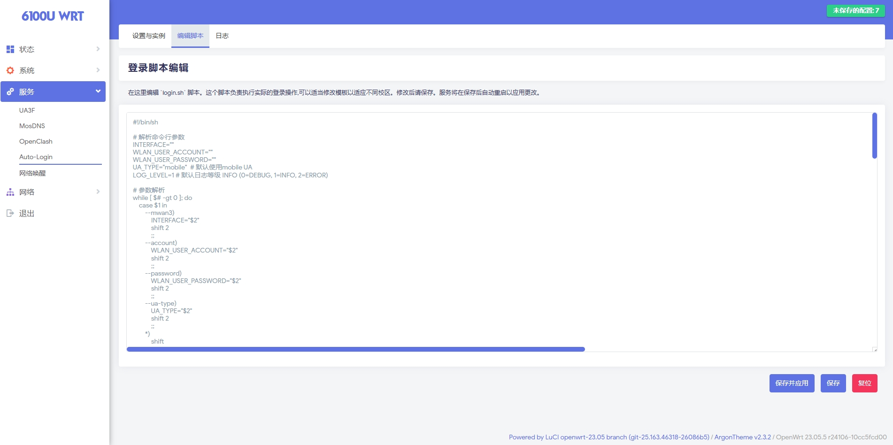
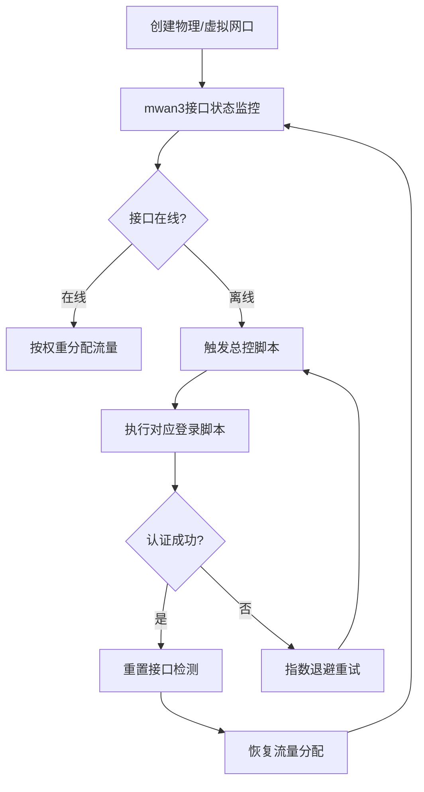

# LuCI App MultiLogin

OpenWrt/LEDE 多wan自动登录 LuCI 应用
适用于openwrt 23.05以及mwan3 2.10+

## 目录

- [功能特性](#功能特性)
- [原理](#原理)
- [依赖](#依赖)
- [安装](#安装)
  - [方法 1: 通过 opkg 安装（推荐）](#方法-1-通过-opkg-安装推荐)
  - [方法 2: 从源码编译](#方法-2-从源码编译)
- [配置说明](#配置说明)
  - [Web 界面配置](#web-界面配置)
  - [登录脚本返回码](#登录脚本返回码)
  - [命令行管理](#命令行管理)
- [故障排查](#故障排查)
  - [服务无法启动](#服务无法启动)
  - [登录失败](#登录失败)
  - [修改配置后不生效](#修改配置后不生效)
- [自定义登录脚本](#自定义登录脚本)
- [许可证](#许可证)
- [贡献](#贡献)
- [致谢](#致谢)

## 功能特性




- 支持多个 WAN 口同时管理
- 自动监控 mwan3 接口状态
- 接口离线时自动尝试登录
- 支持 PC 和移动端 User-Agent 类型
- 失败重试机制（指数退避）
- Web 界面管理配置
- 在线编辑 `login.sh` 脚本
- 服务状态监控和控制

## 原理

本方案通过mwan3的接口状态监控能力与自定义脚本联动，实现智能流量调度和故障自愈。核心原理如下：



详细配置过程请见 [我的博客](https://blog.zesuy.top)。

## 依赖

- `mwan3`
- `curl`
- `bash`

## 安装

### 方法 1: 通过 opkg 安装（推荐）

1.  将编译好的 `.ipk` 文件上传到路由器。
2.  安装软件包：
    ```bash
    opkg install luci-app-multilogin_*.ipk
    ```

### 方法 2: 从源码编译

1.  将 `luci-app-multilogin` 目录复制到 OpenWrt SDK 的 `package/` 目录。
2.  编译：
    ```bash
    make download -j8 V=s
    ./scripts/feeds update -a
    ./scripts/feeds install -a
    make toolchain/install -j$(nproc) V=s
    make package/luci-app-multilogin/compile V=s
    ```
3.  在 `bin/packages/...` 目录中找到生成的 ipk 文件并安装。

## 配置说明

### Web 界面配置

访问 LuCI 界面：`服务` -> `多拨登录`

#### 全局设置

- **启用多拨登录**: 主开关，控制整个服务的启用/禁用。
- **日志级别**: 选择日志记录的详细程度。
- **初始重试间隔**: 登录失败后的初始延迟时间（秒）。
- **状态检查间隔**: 多久检查一次 mwan3 接口状态（秒）。
- **最大重试延迟**: 重试延迟的上限（秒）。
- **已登录状态延迟**: 检测到已登录但接口离线时的延迟（秒）。

#### 服务控制

- 显示当前服务运行状态和 PID。
- 提供启动/停止/重启按钮。

#### 登录脚本编辑

- 在线编辑 `/etc/multilogin/login.sh` 脚本。
- 支持自定义登录逻辑。
- 修改后需要重启服务生效。

#### 登录实例配置

添加和管理多个登录实例：

- **启用**: 控制此实例是否启用。
- **别名**: 为实例设置易于识别的名称。
- **逻辑接口名**: mwan3 中的接口名（如 `wan`, `wan2`）。
- **账号**: 校园网登录账号。
- **密码**: 校园网登录密码。
- **UA类型**: 选择 PC 或移动端。

### 登录脚本返回码

`login.sh` 脚本应返回以下退出码：

- `0`: 登录成功
- `1`: 登录失败
- `2`: 已经登录（无需重复登录）
- `3`: 脚本错误
- `4+`: 其他错误

### 命令行管理

```bash
# 启动服务
/etc/init.d/multilogin start

# 停止服务
/etc/init.d/multilogin stop

# 重启服务
/etc/init.d/multilogin restart

# 查看服务状态
/etc/init.d/multilogin status

# 查看日志
logread | grep multi_login
```

## 故障排查

### 服务无法启动

1.  检查配置文件是否正确：`uci show multilogin`
2.  检查脚本是否存在：`ls -l /etc/multilogin/`
3.  确保脚本有执行权限：`chmod +x /etc/multilogin/*.sh /etc/multilogin/*.bash`
4.  查看系统日志：`logread | grep multilogin`

### 登录失败

1.  检查接口名称是否与 `mwan3 interfaces` 中的名称一致。
2.  检查账号和密码是否正确。
3.  查看详细日志：`logread | grep multi_login`
4.  手动测试登录脚本：
    ```bash
    /etc/multilogin/login.sh --mwan3 wan --account your_account --password your_password --ua-type pc
    ```

### 修改配置后不生效

1.  确保点击了“保存并应用”按钮。
2.  手动重启服务：`/etc/init.d/multilogin restart`

## 自定义登录脚本

如果默认的 `login.sh` 不适合你的校园网，可以在 Web 界面的“登录脚本编辑”部分修改。

脚本接收以下参数：

- `--mwan3 <interface>`: 逻辑接口名
- `--account <username>`: 账号
- `--password <password>`: 密码
- `--ua-type <pc|mobile>`: UA类型

## 许可证

本项目采用 [MIT 许可证](LICENSE)。

## 贡献

欢迎提交 Issue 和 Pull Request。

## 致谢

本项目参考了 [luci-app-nettask](https://github.com/lucikap/luci-app-nettask) 的实现方式。
